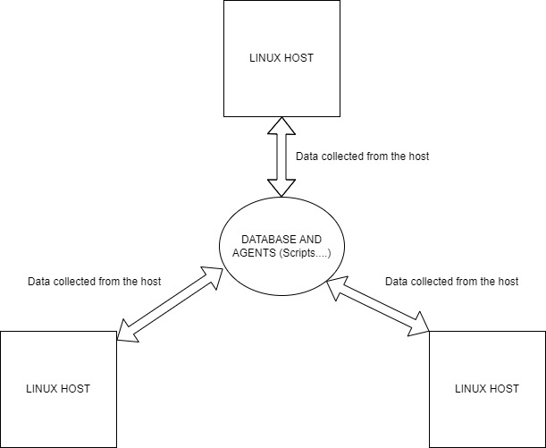

# Introduction
The Linux Cluster Administration (LCA) team is the one responsible for the management of a Linux cluster in the Ecosystem.
They have to continuously collect data about their machines to keep track of the progression and do some updates or revisions on the machines.
The main goal of this project is to help them in that task by providing a fully functional sort of app that will collect the necessary data for them and then keep it in a database by using technologies such as bash, SQL, Git docker, and others.
The project will be done in many phases such as the understanding of the concepts, the initialization of the necessary database, and the implementation of the bash scripts that will do the work just to name a few of the tasks.

# Quick Start
Here are some tasks needed for the project and the commands required for it:


- Start a psql instance using psql_docker.sh:
```bash
 # Create container
	docker volume create jrvs-psql #done
  # Start the container
	docker run --name # parameters
```
- Create tables using ddl.sql:
```sql
 CREATE TABLE PUBLIC.host_info 
  ( 
     id               SERIAL NOT NULL, 
     hostname         VARCHAR NOT NULL, 
     cpu_number       INT2 NOT NULL, 
     cpu_architecture VARCHAR NOT NULL, 
     cpu_model        VARCHAR NOT NULL, 
     cpu_mhz          FLOAT8 NOT NULL, 
     l2_cache         INT4 NOT NULL, 
     "timestamp"      TIMESTAMP NULL, 
     total_mem        INT4 NULL, 
     CONSTRAINT host_info_pk PRIMARY KEY (id), 
     CONSTRAINT host_info_un UNIQUE (hostname) 
  );
  
  CREATE TABLE PUBLIC.host_usage 
  ( 
     "timestamp"    TIMESTAMP NOT NULL, 
     host_id        SERIAL NOT NULL, 
     memory_free    INT4 NOT NULL, 
     cpu_idle       INT2 NOT NULL, 
     cpu_kernel     INT2 NOT NULL, 
     disk_io        INT4 NOT NULL, 
     disk_available INT4 NOT NULL, 
     CONSTRAINT host_usage_host_info_fk FOREIGN KEY (host_id) REFERENCES 
     host_info(id) 
  );
```
- Insert hardware specs data into the DB using host_info.sh:
```bash
# Insertion statement for updating the table
 insert_stmt="INSERT INTO host_info(id, hostname, cpu_number, cpu_architecture, cpu_model, cpu_mhz, l2_cache, "timestamp", total_mem) VALUES('$host_id', '$hostname', '$cpu_number', '$cpu_architecture', '$cpu_model', '$cpu_mhz', '$l2_cache', '$timestamp', '$total_mem')";
```
- Insert hardware usage data into the DB using host_usage.sh:
```bash
# Insertion statement for updating the table
 insert_stmt="INSERT INTO host_usage("timestamp", host_id, memory_free, cpu_idle, cpu_kernel, disk_io, disk_available) VALUES('$timestamp', '$host_id', '$memory_free', '$cpu_idle', '$cpu_kernel', '$disk_io', '$disk_available')";
```
- Crontab setup:
```bash
 # To edit crontab jobs
 bash> crontab -e
```

# Implemenation
The project starts with the docker part which is the platform where we will deploy the app.
The creation of a container and a volume for it was done and all the parameters and environmental variables necessary for the project.<br>
Then there was the setup of the psql database by connecting to it using the hostname, the port number, the username, the database name, and the necessary password to connect to it, and all the parameters and environmental variables necessary for the project. It will be the one receiving the collected data that has to be stocked by the team.<br>
Also, the GitHub repository has to be configured for it to receive all the necessary files. The Gitflow branch method will be the one used here which involves a main branch, a develop branch, and feature branches for all the updates on each specific feature. <br>
All the necessary data will be stored in two specific SQL tables named: host_usage and host_info. Their implementation and updates will be done by using bash scripts.


## Architecture



## Scripts
Shell script description and usage:
- psql_docker.sh: Implementing the container with the database
- host_info.sh: Script meant updating the necessary values in the host_info table
- host_usage.sh: Script meant updating the necessary values in the host_usage table
- crontab: Used for the deployment of the app and the updates every minute
- queries.sql: All the necessary scripts to create the necessary tables and update them


## Database Modeling
These are the looks of the two specific tables where the data will be stored.
This is just for example purposes. None of this data is actually accurate:<br>

- `host_info`

| hostname |cpu_number |cpu_architecture|cpu_model  |cpu_mhz    |l2_cache   |total_mem  | timestamp                             |
|----------|-----------|----------------|-----------|-----------|-----------|-----------|---------------------------------------|
| Demo     | 4 |Intel Core  |Model 3  |2.20   |1420   |14785 | 2024/01/20 14:12:54                   |


- `host_usage`

|timestamp    |host_id   | memory_free| cpu_idle| cpu_kernel     | disk_io | disk_available   |
|-------------|----------|------------|---------|----------------|---------|------------------|
|2024/01/20 14:12:54 |01 | 14520       | 102      | 012        | 1478    | 16000            |

The goal here is to update those tables continuously with the data collected with the scripts.
# Test
The script tests were done by using the command line and the bash command to execute them.<br>
The scripts should take 5 parameters which are inserted in the inputs of the command and then the connection to the database is done by the use of that script and the needed values are added to the initially created tables in the database.<br>
To test if the data was added or not, we just have to connect to the database with the psql command installed earlier and check the values inside the tables with an SQL command such as <br>
```sql
SELECT * FROM host_info;
```
Or
```sql
SELECT * FROM host_usage;
```
The new data should be added as soon as those bash scripts are executed correctly.

# Deployment
The app was deployed for real-time usage using the crontab command which also needed to be installed. A Crontab job for that was created using this sort of command:
```bash
* * * * * bash /home/centos/dev/jrvs/bootcamp/linux_sql/host_agent/scripts/host_usage.sh localhost 5432 host_agent postgres password > /tmp/host_usage.log
```
That command was to initialize the necessary script, do all the updates, and store the necessary in a file to keep.
This is supposed to be done every minute.
We can test if the updates of the tables are accurate by connecting to the database and seeing what the tables look like.

# Improvements
Here are 3 types of improvement that can be made in this project:


- Adding more information to the tables: Depending on the needs of the team, more data could be taken by using the scripts in terms of the user's info and also the usage info. It is something to be well aware of.
- Speed up the processing time (Performance): In this case, the data should be collected and updated every minute for the team to use it. But it could be more performant with certain other parameters. The main focus of the project here is the end product or the MVP but in terms of performance we can try to do better
- Data distribution: The collection of data which is the main focus here is fine but we can also think about a way to distribute the data directly to the LCA team more efficiently on a certain basis like a daily basis or a monthly basis. So that they can have their data well ranged for each part of the time they are working with it. 